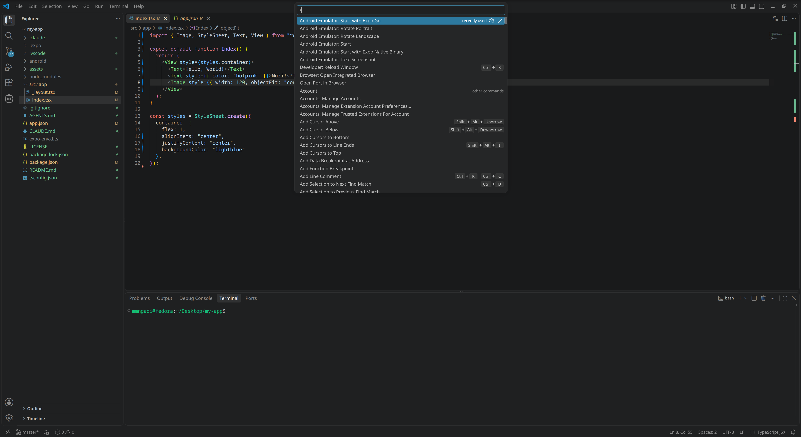
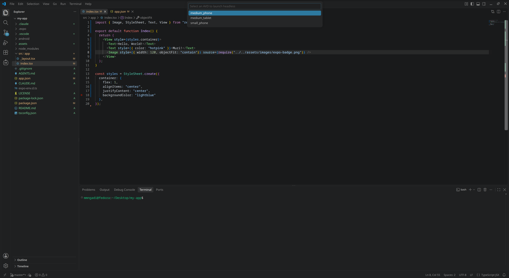
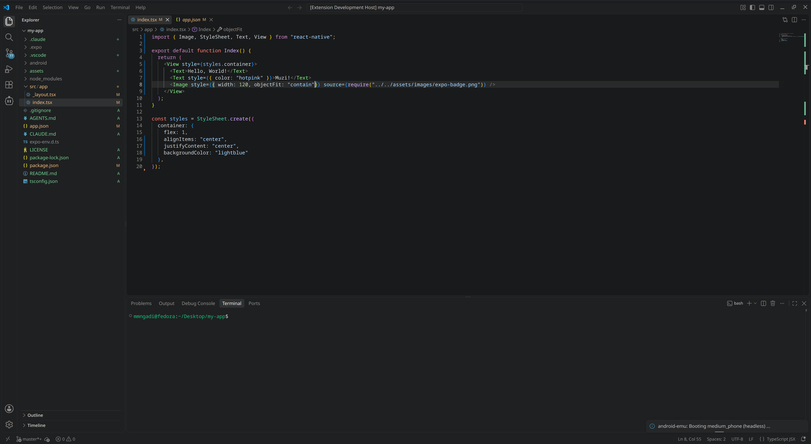
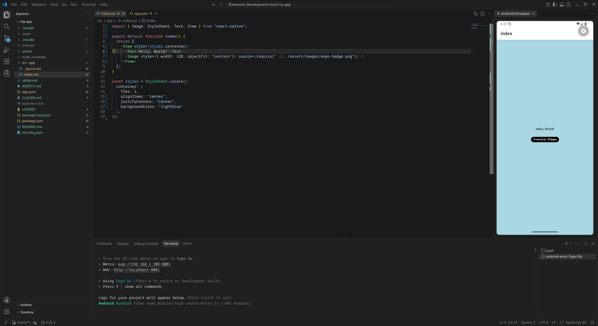

# android-emu

**android-emu** is a VS Code extension that mirrors an Android emulator inside your editor: a live, interactive phone viewport you can click, drag, and type into — plus screenshot and rotation controls — without ever leaving VS Code. It can reuse an emulator you already have running, or boot an AVD fully headless on demand.

## Features

- **Live mirror** — real-time H.264 video of the emulator screen streamed by the **scrcpy device-side server** (pinned v2.4) and decoded in the webview with **WebCodecs** (`optimizeForLatency`), painted straight to a canvas. Glass-to-glass latency is roughly **35–70 ms** — close to native scrcpy. Falls back to the old `screenrecord` + JMuxer pipeline (and to JMuxer if the webview lacks WebCodecs).
- **Interactive touch** — click and drag on the viewport sends real touch sequences to the device (`DOWN` / `MOVE` / `UP` via a persistent adb shell), so taps, swipes, and drags feel like the actual Android emulator.
- **Keyboard input** — click the viewport to focus it and type. Printable characters go through `input text`, special keys (Enter, Backspace, Delete, arrows, Tab, Escape, Home/End, PageUp/PageDown) through `input keyevent`. `Ctrl`/`Cmd`/`Alt` combos are left for VS Code (copy, paste, etc. still work).
- **Headless emulator management** — reuses an already-running emulator, or shows an AVD dropdown and boots a new one headless (no window, no audio). Emulators the extension spawns are shut down when VS Code closes.
- **Rotate Landscape / Rotate Portrait** — animated 90° viewport rotation with a blurred-screenshot placeholder while the device rotates underneath; touch coordinates automatically follow the rotated display.
- **Take Screenshot** — captures the current frame at native device resolution into `<workspace>/.android-emu/screenshots/` with a timestamped filename.
- **Doctor precheck** — every launch validates your host setup and reports exactly what's missing before doing anything else.

## Prerequisites (host machine)

The extension runs a **doctor precheck** every time it starts. All of the following must be present or the launch aborts with a report in the **android-emu** output channel:

| Check | Requirement | How the doctor validates it |
|---|---|---|
| Android SDK | `ANDROID_HOME` set to the SDK root | Variable is set and the directory exists |
| Emulator | Android Emulator package installed | `$ANDROID_HOME/emulator/emulator` exists and `emulator -list-avds` exits 0 |
| adb (platform-tools) | Platform-tools installed | `$ANDROID_HOME/platform-tools/adb` exists (falls back to `adb` on PATH) |
| scrcpy | scrcpy installed and on `PATH` | `scrcpy --version` exits 0 |
| AVD | At least one AVD created | `emulator -list-avds` returns a non-empty list (only required when no emulator is already running) |

### 1. Install scrcpy

```bash
# Fedora / RHEL
sudo dnf install scrcpy
# Debian / Ubuntu
sudo apt install scrcpy
# Arch
sudo pacman -S scrcpy
# macOS
brew install scrcpy
# Windows (winget / choco / scoop)
winget install Genymobile.scrcpy
```

Verify with `scrcpy --version`. (scrcpy is a validated prerequisite; the live video pipeline itself uses adb's built-in `screenrecord`.)

### 2. Install the Android SDK and set `ANDROID_HOME`

Install [Android Studio](https://developer.android.com/studio) (easiest) or the [command-line tools](https://developer.android.com/studio#command-line-tools-only), and make sure the SDK includes **Android SDK Platform-Tools** and **Android Emulator** (SDK Manager → SDK Tools).

```bash
# Typical location on Linux — adjust to your install
export ANDROID_HOME="$HOME/Android/Sdk"
```

Add that to your shell profile (`~/.bashrc` / `~/.zshrc`).

> **Important:** VS Code must inherit `ANDROID_HOME`. If you launch VS Code from a desktop icon it may not read your shell profile — start it from a terminal, or set the variable system-wide (e.g. `~/.config/environment.d/android-sdk.conf` on systemd distributions).

### 3. Create at least one AVD

Via Android Studio's Device Manager, or with `avdmanager`:

```bash
"$ANDROID_HOME/cmdline-tools/latest/bin/avdmanager" create avd \
  -n medium_phone -d pixel -k "system-images;android-35;google_apis;x86_64"
```

Confirm the extension will find it:

```bash
"$ANDROID_HOME/emulator/emulator" -list-avds
```

## Usage Steps

### Step 1: Run with Expo Go


### Step 2: Choose AVD


### Step 3: Emulator Loading


### Step 4: Emulator Running Expo Go in VS Code


---


## Extension commands (API)

All commands live in the Command Palette under the **Android Emulator** category:

| Command ID | Palette title | Description |
|---|---|---|
| `android-emu.start` | **Android Emulator: Start** | Runs the doctor precheck, reuses a running emulator (or shows the AVD dropdown and boots one headless), then opens the interactive mirror panel. |
| `android-emu.screenshot` | **Android Emulator: Take Screenshot** | Captures the current live frame at native device resolution and saves it to `<workspace>/.android-emu/screenshots/screenshot_<YYYY-MM-DD_HH-MM-SS-mmm>.png`. Shows an error if no mirror session is active or no workspace folder is open. |
| `android-emu.rotateLandscape` | **Android Emulator: Rotate Landscape** | Forces the display to landscape and locks rotation. If already landscape: no-op, with an info message. Animates the viewport spin with a blurred-screenshot placeholder while the device rotates. |
| `android-emu.rotatePortrait` | **Android Emulator: Rotate Portrait** | Forces the display to portrait and locks rotation. If already portrait: no-op, with an info message. Same animated transition as Rotate Landscape. |
| `android-emu.startExpoGo` | **Android Emulator: Start with Expo Go** | Validates the workspace is an Expo project, ensures an emulator is running and fully booted (reusing or headless-booting one), opens the mirror, then runs `npx expo start --android` in a terminal — the Metro dev server starts, port 8081 is reverse-proxied and the project opens in the **Expo Go** app. Warns if Expo Go is not installed on the emulator. |
| `android-emu.startExpoNative` | **Android Emulator: Start with Expo Native Binary** | Same emulator/boot/mirror flow, then runs `npx expo run:android` in a terminal — Gradle compiles a native debug binary of the project, installs it on the emulator and starts the Metro dev server. Use this when the project needs native modules not supported by Expo Go. |

The extension contributes no VS Code settings (`contributes.configuration`) — behavior constants such as the WebSocket port (`9225`) and the boot-wait timeout (`120s`) are currently internal.

## Usage

1. Command Palette → **Android Emulator: Start** (the doctor precheck runs first).
2. If an emulator is already running it is reused; otherwise pick an AVD from the dropdown and wait for the headless boot (usually ~15–90 s; progress is shown, 120 s timeout).
3. The mirror panel opens with the live feed. Click the phone frame to focus it for keyboard input; drag the tab out into its own window if you prefer — the feed re-syncs automatically.

### Launching an Expo project

Two commands launch a React Native **Expo** project onto the emulator. Both require the workspace root to be an Expo project (an `app.json` with an `"expo"` block, or an `expo` dependency in `package.json`) and `npx` (Node.js) on `PATH`:

- **Android Emulator: Start with Expo Go** — boots/reuses the emulator, waits for the full Android boot, opens the mirror, and runs `npx expo start --android` in a terminal. The project loads inside the **Expo Go** app (package `host.exp.exponent`). If Expo Go is missing on the emulator, install it from the Play Store *inside the emulator*, then press `a` in the Expo terminal. Fastest iteration loop; no native compile.
- **Android Emulator: Start with Expo Native Binary** — same emulator flow, then runs `npx expo run:android`: Gradle builds a native debug binary (requires a JDK and the Android SDK — the first build can take several minutes), installs it on the emulator and starts Metro. Use it when the project uses native modules or a config plugin not supported by Expo Go.

The Expo terminal is a normal VS Code integrated terminal, so all Expo CLI shortcuts keep working (`r` reload, `a` reopen on Android, `j` open debugger, `Ctrl+C` stop).

## How it works

- **Video (low latency, default)**: the extension runs the pinned scrcpy-server v2.4 on the device (`adb shell CLASSPATH=… app_process / com.genymobile.scrcpy.Server 2.4 … raw_stream=true`) and reads a pure H.264 Annex-B stream from a `adb forward`ed localabstract socket → WebSocket `ws://localhost:9225` → **WebCodecs `VideoDecoder`** → `<canvas>`. The webview parses the stream into NAL units, builds the `avcC` decoder configuration from the SPS/PPS, and decodes with `optimizeForLatency: true`; each frame is painted the instant it is decoded (no MediaSource buffering, no "tap the screen first" priming).
- **Video (fallback)**: if the scrcpy-server jar cannot be obtained (first run offline), the original pipeline runs instead: `adb exec-out screenrecord --output-format=h264 -` → WebSocket → JMuxer → MSE `<video>` (~1 s latency, ~3 min stream restarts, notification-shade priming).
- **Input**: with scrcpy active, touch and key events are injected via the scrcpy **control socket** (binary protocol, ~1 ms per event — the same mechanism the native scrcpy client uses). Text still goes through the adb shell (`input text`). On the fallback pipeline, all input goes through the shell (`input motionevent`/`keyevent`/`text`), which costs ~100–300 ms per event on the device.
- **Rotation**: `cmd window user-rotation lock <n>` on the device, while the webview animates a 90° CSS spin using a blurred screenshot of the current frame as a placeholder. When the device has rotated, the JMuxer decoder is recreated (MSE cannot handle a mid-stream resolution change) and a fresh stream fills the already-rotated viewport.
- **Emulator lifecycle**: headless launches use crash-safe flags (the default flag set segfaults on some host GPU/driver stacks, e.g. Fedora 44 + Mesa 26):

  ```bash
  "$ANDROID_HOME/emulator/emulator" -avd <name> -no-window -no-audio \
    -gpu swangle -feature -Vulkan -no-boot-anim -no-snapshot-load \
    -camera-back none -camera-front none
  ```

  Emulators spawned by the extension are killed (by process group) when VS Code closes. Emulators that were already running are never touched.

## Known limitations

- **scrcpy-server jar download on first run** — the pinned v2.4 server jar is cached in the extension's global storage; the very first start needs internet (or a host scrcpy 2.4 install) to fetch it. Offline without a cached jar, the extension automatically falls back to the legacy screenrecord pipeline (~1 s latency).
- **Typing latency**: printable-character input still uses `input text` through the adb shell (~100–300 ms per burst); touch and special keys are instant via the scrcpy control socket.
- **Single-pointer touch only** — no pinch/multi-touch gestures.
- **Spawned emulators die on reload**: they are killed when the VS Code window closes *or* reloads (the extension host shuts down in both cases). Already-running emulators are unaffected.
- **One mirror session at a time** (fixed port `9225`).
- **Screenshots need a workspace** — a folder must be open so `.android-emu/screenshots/` has somewhere to go.
- **Fallback pipeline** (no scrcpy jar): ~1 s latency, ~2 fps on static screens (notification-shade priming), and a stream restart every ~3 minutes with a brief blip.

## Development

```bash
npm install
npm run compile   # check-types + lint + esbuild -> dist/extension.js
```

Then press **F5** in VS Code to launch an Extension Development Host and run **Android Emulator: Start** there. Diagnostics are logged to the **android-emu** output channel (`[doctor]`, `[emu]`, `[mirror]`, `[screenrecord]`, `[rotate]`, `[screenshot]`).


